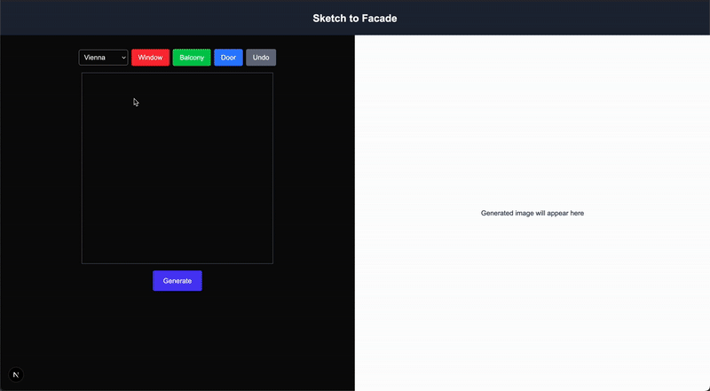
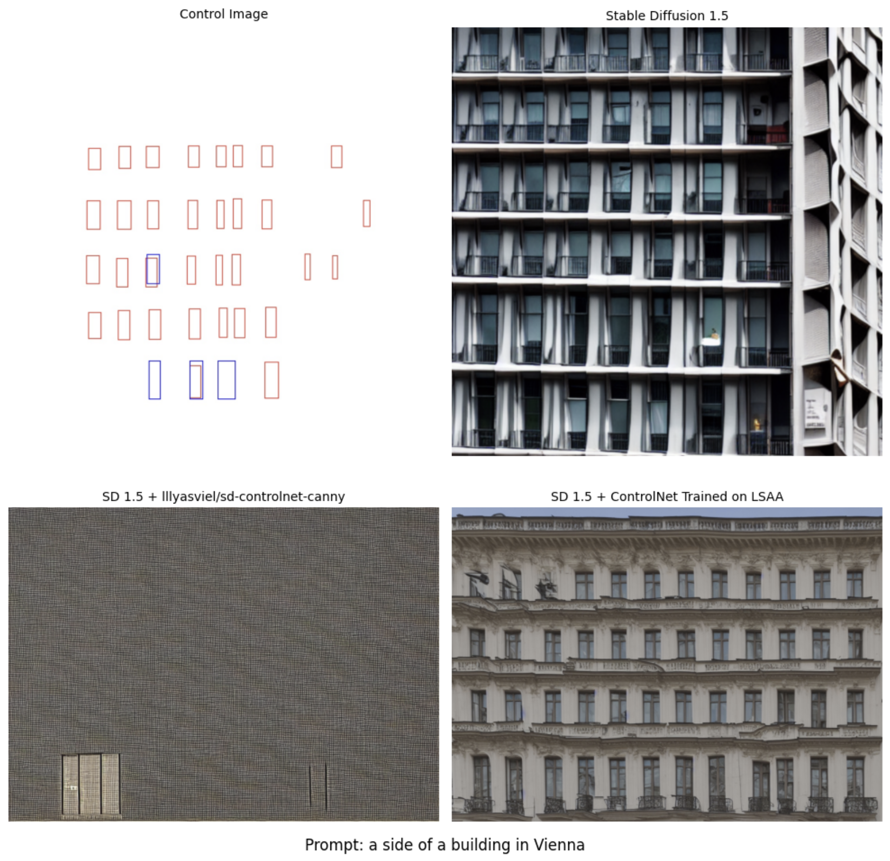

# Sketch to Facade

## Demo

## Model Training

Here is an example of Stable Diffusion 1.5, SD 1.5 with lllyasviel/sd-controlnet-canny, and SD 1.5 with my ControlNet fine tuned on the LSAA Dataset. The vanilla SD 1.5 actually performs really well, but the image doesn't look remeniscant of Vienna. lllyasviel/sd-controlnet-canny performs really bad despite being finetuned for canny edge detector. Based on what I saw on the hugging face page, I assume this is because it was trained for more specific edge masks. Mine perform's the best, being able to capture the windows from the sketch and making it seem like it's from Vienna.

### Dataset
I used the LSAA dataset that has images of side of buildings from Google Streetview. To create sketches, I mapped the bounded boxes to blank images and used that data to finetune the model.

## Web App
The website is made in React. The backend was built using FastAPI. Because of the high costs of maintaining an API for inference, I did not deploy this project. However, you can recreate it by using this repository and my hugging face model [here](https://huggingface.co/plin11/sketch-to-facade/tree/main).

## Future Work
- Use new models. Stable Diffusion 1.5 is 3+ years old now.
- Improve fine tuning. Mainly, removing warping and using LoRA for handling city features.
- Custom dataset using Google Streetview.
